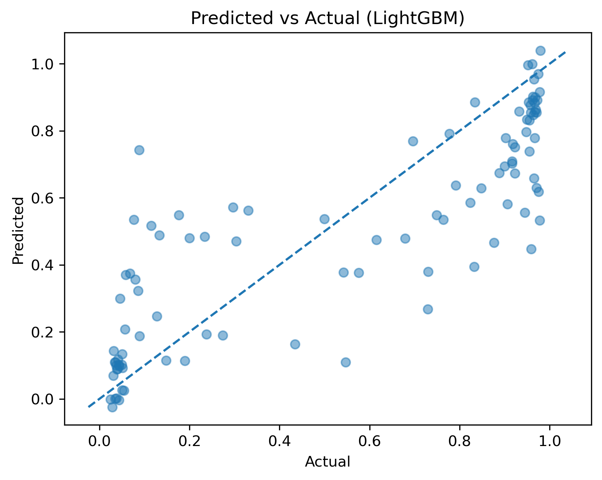
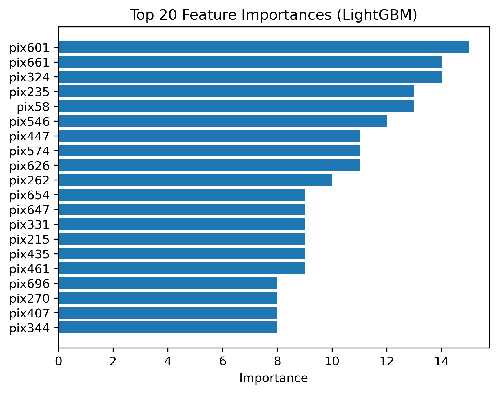
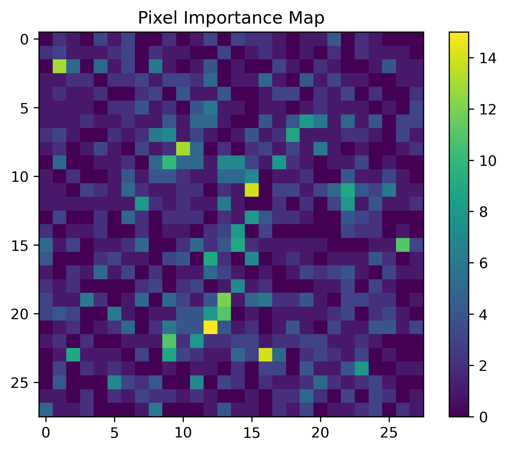

# 🧠 Brain Imaging Regression – Neurodegenerative Indicator Prediction

## Overview

This project builds an end-to-end machine learning pipeline to predict a continuous neurodegenerative disease indicator from brain imaging data.

The task is formulated as a supervised regression problem using preprocessed 2D brain image features. The objective is to accurately estimate a clinical score (ranging from 0 to 1) associated with neurodegeneration.

---

## Key Features

* Full ML pipeline from raw data → model → evaluation
* Comparison of multiple models:

  * Linear Regression
  * Random Forest
  * LightGBM
* Cross-validation based model selection
* Feature importance–driven dimensionality reduction
* Hyperparameter tuning using RandomizedSearchCV
* Visual diagnostics and model interpretation

---

## Results

| Model                                | R² Score            |
| ------------------------------------ | ------------------- |
| Linear Regression                    | Poor (underfitting) |
| Random Forest                        | ~0.63               |
| LightGBM (baseline)                  | ~0.73               |
| LightGBM (tuned + feature selection) | **0.78**            |

Feature selection significantly improved performance, with optimal results using ~100 most important features.

---

## Visualizations

### Predicted vs Actual



### Residual Analysis


### Feature Importance



### Pixel Importance Heatmap



---

## Approach

### 1. Data Processing

* Loaded training features and targets
* Dropped non-informative ID column
* Combined and cleaned dataset
* Train-validation split

### 2. Baseline Modeling

* Implemented multiple regression models
* Evaluated using:

  * R² Score
  * Mean Squared Error

### 3. Model Selection

* Used cross-validation for robust comparison
* Selected LightGBM as best-performing model

### 4. Feature Selection

* Extracted feature importances from LightGBM
* Tested subsets: top 10 → 200 features
* Identified optimal range (~100 features)

### 5. Hyperparameter Tuning

* Applied RandomizedSearchCV
* Optimized model performance

### 6. Interpretation

* Visualized important pixel regions
* Analyzed residuals and prediction behavior

---

## Tech Stack

* Python
* Pandas, NumPy
* Scikit-learn
* LightGBM
* Matplotlib

---

## How to Run

```bash
pip install -r requirements.txt
```

Open the notebook:

```bash
jupyter notebook notebooks/neurodegeneration.ipynb
```

---

## Future Improvements

* Use CNNs for spatial feature learning
* Apply PCA or autoencoders for dimensionality reduction
* Experiment with ensembling methods
* Incorporate explainability tools (e.g., SHAP)

---

## Notes

* Dataset used is synthetic/preprocessed for competition purposes
* Focus is on building a strong ML pipeline rather than clinical deployment

---

## Author

Ibrahim Waiz
